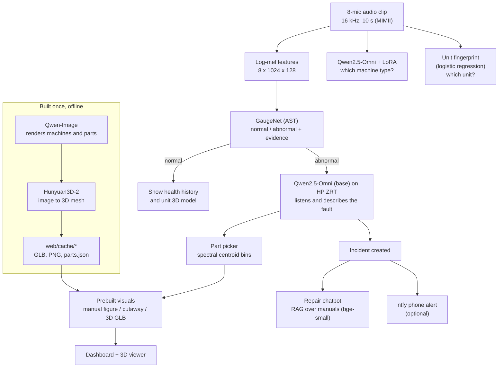

<div align="center">

# Gauge

### Edge AI that hears machine faults, shows where they are in 2D and 3D, and guides the repair.

**Runs on one HP ZGX Nano (NVIDIA GB10), served with HP Z Runtime (ZRT). No cloud AI. Raw audio is never stored or sent.**


[What it does](#1-what-gauge-does) ·
[Architecture](#2-architecture) ·
[Models](#3-the-models) ·
[Repo map](#4-repository-map) ·
[**Rebuild from scratch**](#6-rebuild-everything-from-scratch) ·
[Test it](#7-test-it) ·
[Troubleshooting](#9-troubleshooting)

</div>

---

## 1. What Gauge does

Factory machines change how they sound long before they break. Factory floors are too loud for people or simple alarms to catch that early. Gauge listens instead.

Upload (or stream) a 10-second recording from an 8-microphone array and Gauge will:

| # | Step | What you see on the dashboard |
|---|---|---|
| 1 | **Detect** | Normal or abnormal, with an anomaly probability and a level: watch, warning or critical |
| 2 | **Explain the evidence** | Which frequency bands and which microphones drove the decision, plus the spectrogram |
| 3 | **Identify** | Machine type (fan, pump, valve) and the exact unit (for example `fan id_00`) from sound alone |
| 4 | **Diagnose** | Likely faulty part, fault description, severity, and what the fault sounds like |
| 5 | **Locate** | The part highlighted on a real manual drawing, a cutaway image, and a rotatable 3D model |
| 6 | **Compare** | Defective part (orange) next to the healthy part (green) in 3D |
| 7 | **Guide the repair** | A chatbot that answers only from real maintenance manuals, with page citations |
| 8 | **Alert** | Optional phone push notification (text and image only, never audio) |

---

## 2. Architecture



**Why this design**

- **Cheap model first, expensive model only when needed.** GaugeNet runs on every clip. The large Omni model only writes a diagnosis when a clip is abnormal.
- **3D assets are prebuilt.** Image and 3D generation take minutes, so they run once offline. At run time the server only picks the right cached files.
- **Answers are grounded.** The chatbot only uses retrieved manual pages and cites them. It is told never to invent torque values or part numbers.

---

## 3. The models

| Role | Model | Trained or used how | Script | Output |
|---|---|---|---|---|
| Fault detector | **GaugeNet**: `MIT/ast-finetuned-audioset-10-10-0.4593` + 8-mic attention fusion + frequency attention head | Fine-tuned on MIMII fan + pump, 0 dB and 6 dB | `ast_model_training_scripts/train_guage.py` | `~/Desktop/edge-ai/runs/gauge_combined/best_model.pt` |
| Machine type | **Qwen2.5-Omni** (thinker) + LoRA | LoRA fine-tune on MIMII fan, pump, valve | `app/finetune_omni.py` | `models/omni-gauge-lora/` |
| Fault description + chatbot | **Qwen2.5-Omni** (base) served by **HP Z Runtime (ZRT)** on the Nano, with tool calling | Used as-is, prompted | `zrt serve`, `app/vllm_client.py` | OpenAI-compatible endpoint on port 8080 |
| Unit fingerprint | Log-mel + spectral stats → **Logistic regression** | Trained on MIMII units | `app/train_asset.py` | `models/asset_id.joblib` |
| Part picker | Spectral centroid percentile bins | Calibrated on MIMII abnormal clips | `app/calib_parts.py` | `models/part_bins.json` |
| Manual search | **BAAI/bge-small-en-v1.5** embeddings | Used as-is | `app/ingest_manuals.py` | `manuals/index.npz`, `manuals/chunks.json` |
| Images | **Qwen-Image** (diffusers) | Used as-is, offline | `app/rebuild_visuals.py`, `app/build_assets.py`, `app/gen_cutaways.py` | `web/cache/**.png` |
| 3D meshes | **Hunyuan3D-2** (`tencent/Hunyuan3D-2`) | Used as-is, offline | same as above | `web/cache/**.glb` |

<details>
<summary><b>How GaugeNet works (click to expand)</b></summary>

1. **Input.** Each of the 8 microphone channels becomes a Kaldi-style log-mel spectrogram: 1024 frames x 128 mel bands, normalized with AudioSet mean and std (`-4.2677`, `4.5690`).
2. **Mic attention fusion.** For each mic and mel band, the model looks at mean and std over time, scores it, and softmaxes across the 8 mics. The 8 spectrograms are blended into one. The last layer starts at zero, so training begins from a plain average.
3. **AST backbone.** The fused spectrogram goes through the Audio Spectrogram Transformer, pretrained on AudioSet.
4. **Frequency attention head.** AST patch outputs are averaged over time per frequency band (12 bands), scored, and softmaxed. These weights tell you which pitch range drove the decision. The dashboard shows them.
5. **Classifier.** AST's global summary + the band summary → normal / abnormal.

**Training setup**

- Leak-free split: each original recording's 0 dB and 6 dB copies stay in the same split. 70 / 15 / 15 within every (machine, id, label).
- Class-weighted cross-entropy, because abnormal clips are rarer.
- AdamW with two learning rates: `1e-5` for AST, `1e-3` for the new layers. Batch 4, bf16 autocast, gradient clipping 1.0.
- Up to 100 epochs, early stopping after 10 epochs without a better validation AUC.
- The test split is touched only once, after training.

</details>

<details>
<summary><b>How the Omni LoRA fine-tune works (click to expand)</b></summary>

- Base: Qwen2.5-Omni, only the **thinker** (the part that listens and writes text).
- Task: listen to a clip and answer `{"machine": "fan|pump|valve"}`.
- Data: all MIMII units except `id_06` for training (400 clips per machine and status by default). `id_06` is held out, so the test is on machines the model has never heard.
- LoRA: `r=16`, `alpha=32`, dropout `0.05`, on `q/k/v/o` attention projections of the text layers (not the audio tower). 1 epoch, LR `1e-4`, gradient accumulation 8.
- It prints accuracy **before** and **after** training on the held-out units.

</details>

---

## 4. Repository map

```
gauge-acoustic-diagnostics/
│
├── ast_model_training_scripts/      ── Fault detector (GaugeNet)
│   ├── merge_mimii_data.py          merge 0 dB + 6 dB MIMII into one folder + manifest CSV
│   ├── data_preprocessing.py        8-mic log-mel features → .npy (~40 GB)
│   ├── train_guage.py               train GaugeNet, early stopping, test report
│   └── predict.py                   test one clip, prints probability, bands, mic weights, latency
│
├── app/                             ── Everything the product runs on
│   ├── server.py                    FastAPI backend: /analyze, /chat, /incident, serves web/
│   ├── finetune_omni.py             LoRA fine-tune of Qwen2.5-Omni (machine type)
│   ├── train_asset.py               unit fingerprint classifier (which fan / pump / valve)
│   ├── calib_parts.py               frequency bins that map a sound to a part
│   ├── ingest_manuals.py            chunk + embed manuals for the repair chatbot
│   ├── manual_figures.py            find the real part drawing in each manual and heat-mark it
│   ├── rebuild_visuals.py           per machine type: photo, studio render, 3D housing, internal parts
│   ├── build_parts.py               older internal-parts builder (superseded by rebuild_visuals.py)
│   ├── build_assets.py              per unit (id_00, id_06, ...): own housing, 3D and cutaways
│   ├── gen_cutaways.py              catalog-style cutaway images per part (optional)
│   ├── export_parts_print.py        3D-printable defective and fixed parts (STL / OBJ / GLB)
│   ├── listen.py  draw.py           ┐
│   ├── shape.py   tighten.py        ┘ first CLI prototype pipeline, used by run.sh
│
├── web/                             ── Frontend (served by server.py)
│   ├── index.html                   main dashboard
│   ├── viewer.html                  3D inspection viewer (three.js)
│   ├── chat.html                    repair assistant
│   ├── test.html                    minimal upload test page
│   └── cache/                       prebuilt visuals per machine and per unit
│       ├── fan/ pump/ valve/        type-level: photo, machine.glb, parts/, manual_*.png
│       └── fan_id_00/ ... valve_id_06/   unit-level: own machine.glb, cutaways, parts
│
├── manuals/                         ── Repair knowledge
│   ├── sources.json                 list of manuals and which machine they cover
│   ├── chunks.json  index.npz       text chunks + embeddings (from ingest_manuals.py)
│   └── fan/ pump/ valve/ all/       PDFs (downloaded by get_manuals.sh)
│
├── out/                             ── Outputs of the CLI prototype (run.sh / batch.sh)
│
├── Hunyuan3D-2/                     git submodule: Tencent's image-to-3D code
│
├── patch_*.py  apply_patches.sh     feature patches for server.py (already applied here)
├── get_manuals.sh                   download public manuals
├── rebuild / build scripts          build_fast.sh, build_all.sh
├── check_all.sh                     readiness check before a demo
├── run.sh  batch.sh                 CLI prototype pipeline
└── .gitignore  .gitmodules
```

**Not in git (you create these):** `models/` (weights), MIMII audio, extracted features, `runs/`.

---

## 5. Folder layout the code expects

The scripts use fixed paths. Match this layout exactly and everything runs without edits.

```
~/Desktop/
└── edge-ai/
    ├── data/
    │   ├── 0_dB_fan/fan/id_00/{normal,abnormal}/*.wav
    │   ├── 6_dB_fan/fan/...
    │   ├── 0_dB_pump/pump/...
    │   ├── 6_dB_pump/pump/...
    │   ├── combined_data_shuffled/           (created by merge_mimii_data.py)
    │   └── features_8mic/                    (created by data_preprocessing.py)
    ├── runs/gauge_combined/best_model.pt     (created by train_guage.py)
    └── team/                                  <- any folder name
        └── gauge/                            <- this repository
            └── models/
                ├── omni/                      Qwen2.5-Omni weights
                ├── qwen-image/                Qwen-Image weights
                ├── omni-gauge-lora/           LoRA adapter
                ├── asset_id.joblib
                └── part_bins.json
~/Downloads/6_dB_valve/valve/id_00/...        valve clips (the app scripts look for ~/Downloads/*valve*)
```

> **Why this exact nesting?** The AST scripts read `~/Desktop/edge-ai/data` and `~/Desktop/edge-ai/runs`. The `app/` scripts look two folders above `gauge/` for `data/` (here `~/Desktop/edge-ai/data`) and in `~/Downloads/*valve*`. With the repo at `edge-ai/<name>/gauge`, both point at the same data. If you put `gauge` directly in `edge-ai`, add a symlink: `ln -s ~/Desktop/edge-ai/data ~/Desktop/data`.

---

## 6. Rebuild everything from scratch

> Target: an HP ZGX Nano (NVIDIA GB10, ARM64, Ubuntu-based DGX OS). Any Linux machine with a large NVIDIA GPU should work, but timings below are from the ZGX Nano.

### Progress checklist

- [ ] 1. Clone
- [ ] 2. Environment
- [ ] 3. Model weights
- [ ] 4. MIMII data
- [ ] 5. Train GaugeNet
- [ ] 6. Fine-tune Omni
- [ ] 7. Unit fingerprint + part bins
- [ ] 8. Manuals
- [ ] 9. Visuals and 3D
- [ ] 10. Server patches
- [ ] 11. Readiness check
- [ ] 12. Launch

---

### Step 1. Clone the repo into the expected place

```bash
# "team" can be any folder name, but keep this nesting: edge-ai/<folder>/gauge
mkdir -p ~/Desktop/edge-ai/team && cd ~/Desktop/edge-ai/team
git clone --recurse-submodules https://github.com/siliconsquad6/gauge-acoustic-diagnostics.git gauge
cd gauge
```

**What this does:** gets the code and pulls Hunyuan3D-2 as a submodule. The folder must be named `gauge` and sit two levels below `edge-ai`, because the scripts compute paths from it (see [section 5](#5-folder-layout-the-code-expects)).

---

### Step 2. Create the Python environment

The build scripts activate a conda env named `gauge` from `~/miniforge3`.

```bash
# Miniforge (ARM64 build for the ZGX Nano)
wget https://github.com/conda-forge/miniforge/releases/latest/download/Miniforge3-Linux-aarch64.sh
bash Miniforge3-Linux-aarch64.sh -b -p ~/miniforge3
source ~/miniforge3/etc/profile.d/conda.sh
conda create -y -n gauge python=3.10
conda activate gauge
```

Install PyTorch with CUDA for your platform first (follow the selector on pytorch.org for ARM64 + CUDA), then:

```bash
pip install torchaudio transformers accelerate peft qwen-omni-utils diffusers \
            soundfile librosa pandas numpy scikit-learn scikit-image scipy joblib \
            fastapi uvicorn python-multipart pydantic requests \
            sentence-transformers pymupdf trimesh opencv-python pillow

# Hunyuan3D-2 (image to 3D)
cd Hunyuan3D-2 && pip install -r requirements.txt && pip install -e . && cd ..
```

**What this does:** installs everything for audio (torchaudio, librosa), the models (transformers, peft, diffusers), 3D (trimesh, Hunyuan3D), the manuals (pymupdf, sentence-transformers) and the web server (fastapi, uvicorn).

> Qwen2.5-Omni and Qwen-Image need recent `transformers` and `diffusers`. If a model fails to load, upgrade those two first.

---

### Step 3. Download the model weights

```bash
pip install -U "huggingface_hub[cli]"
huggingface-cli download Qwen/Qwen2.5-Omni-7B --local-dir models/omni
huggingface-cli download Qwen/Qwen-Image     --local-dir models/qwen-image
```

**What this does:** puts the two large models where the code looks for them (`models/omni`, `models/qwen-image`).

These download automatically on first use, no action needed:
`MIT/ast-finetuned-audioset-10-10-0.4593`, `tencent/Hunyuan3D-2`, `BAAI/bge-small-en-v1.5`.

> Use the Omni size your team used. The code works with any Qwen2.5-Omni checkpoint in `models/omni`.

---

### Step 4. Get the MIMII dataset

MIMII is a public dataset of real industrial machine sounds, recorded with an 8-mic circular array at 16 kHz, 10 s per clip, with real factory noise mixed in. Download from Zenodo: <https://zenodo.org/record/3384388>

We use **fan** and **pump** at **0 dB** and **6 dB** (for GaugeNet) and **valve** (for the Omni fine-tune, fingerprint and part bins).

```bash
cd ~/Desktop/edge-ai && mkdir -p data && cd data
# after downloading the zips here:
for f in 0_dB_fan 6_dB_fan 0_dB_pump 6_dB_pump; do mkdir -p $f && unzip -q $f.zip -d $f; done
mkdir -p ~/Downloads/6_dB_valve && unzip -q 6_dB_valve.zip -d ~/Downloads/6_dB_valve

```

**Check:** `ls ~/Desktop/edge-ai/data/0_dB_fan/fan` should show `id_00 id_02 id_04 id_06`.

---

### Step 5. Train the fault detector (GaugeNet)

```bash
cd ~/Desktop/edge-ai/team/gauge
python ast_model_training_scripts/merge_mimii_data.py
python ast_model_training_scripts/data_preprocessing.py
python ast_model_training_scripts/train_guage.py
python ast_model_training_scripts/predict.py --abnormal
```

| Script | Concept | Output |
|---|---|---|
| `merge_mimii_data.py` | Copies fan and pump clips from both noise levels into one tree. Filenames get the noise prefix (`0_dB_...`) so twins can be tracked. Writes a manifest. | `data/combined_data_shuffled/` + `merge_manifest.csv` |
| `data_preprocessing.py` | Turns every clip into 8 log-mel spectrograms (one per mic). Uses 12 CPU workers and memory-mapped files. **Needs ~40 GB disk.** | `data/features_8mic/{fan,pump}_features.npy` + `_meta.csv` |
| `train_guage.py` | Trains GaugeNet (see [section 3](#3-the-models)). Validates every 500 steps and every epoch. | `runs/gauge_combined/`: `best_model.pt`, `history.csv`, `split_meta.csv`, `results.json`, `test_predictions.csv`, `test_explanations.npz` |
| `predict.py` | Runs one held-out test clip and prints the probability, top frequency bands, mic weights and latency. | JSON on screen |

**Check:** `results.json` has test AUC, accuracy, F1, a confusion matrix, and AUC per machine, noise level and unit.

---

### Step 6. Fine-tune Qwen2.5-Omni to recognise the machine

```bash
python app/finetune_omni.py          # 400 clips per (machine, status)
# python app/finetune_omni.py 800    # more data, longer

# the server loads "omni-gauge-lora", the script saves "omni-gauge-lora-machine"
ln -s omni-gauge-lora-machine models/omni-gauge-lora
```

**Concept:** LoRA adds small trainable matrices to the attention layers, so a 7B model can learn a new task in one epoch on one GPU without changing its original weights. The server turns the adapter **on** to classify the machine and **off** to describe faults and chat.

**Check:** the log prints `[BEFORE fine-tune]` and `[AFTER fine-tune]` accuracy on unit `id_06`.

---

### Step 7. Train the unit fingerprint and calibrate part bins

```bash
python app/train_asset.py      # CPU, ~10 min
python app/calib_parts.py      # CPU, ~2 min
```

| Script | Concept | Output |
|---|---|---|
| `train_asset.py` | MIMII ids are different product models, so each unit sounds different even when healthy. Mean and std of a 64-band log-mel + spectral centroid and flatness → standardized → logistic regression. 700 clips per unit, 80/20 report, then refit on all. | `models/asset_id.joblib` |
| `calib_parts.py` | Low-frequency energy points to slow rotating parts (shaft, motor). High-frequency energy points to bearings, seals, seats. Splits each machine's spectral-centroid range into one bin per part using real abnormal clips. | `models/part_bins.json` |

---

### Step 8. Build the repair knowledge base

```bash
bash get_manuals.sh              # downloads 6 public manuals
python app/ingest_manuals.py     # chunks + embeds them
python app/manual_figures.py     # finds each part's drawing and heat-marks it
```

| Script | Concept | Output |
|---|---|---|
| `get_manuals.sh` | Public manuals: Peerless pump IOM, US DOE pump and fan sourcebooks, Greenheck fan IOM, ASCO 8210 solenoid valve, OSHA lockout/tagout. | `manuals/*/*.pdf`, `sources.json` |
| `ingest_manuals.py` | Retrieval-augmented generation (RAG). Each page is split into 900-character chunks with 150 overlap, tagged with title, page and machine, and embedded with bge-small. | `manuals/index.npz`, `manuals/chunks.json` |
| `manual_figures.py` | Searches each machine's manuals for pages with a figure that labels the part, renders it, and paints a heat blob on the label. Pin a wrong pick in `manuals/figures_override.json`. | `web/cache/<machine>/manual_<part>.png` + `.json` |

**Check:** every PDF is larger than ~50 KB (a tiny file means the download was blocked).

---

### Step 9. Build the visuals and 3D models

> **Skip this step if you only want to run the demo.** `web/cache/` in this repo already contains the built assets for `fan`, `pump`, `valve` and units `id_00` and `id_06`.

Stop the server first. These scripts need the whole GPU.

```bash
# Option A: fast build, ~70 min (what the demo uses)
bash build_fast.sh 2>&1 | tee build.log

# Option B: full build, ~3 h (all units), run inside tmux
bash build_all.sh
```

What happens inside:

| Script | Concept | Output |
|---|---|---|
| `rebuild_visuals.py` | Per machine type: Qwen-Image draws a realistic factory photo and a studio render with the fault zone glowing. Hunyuan3D-2 turns the render into a 3D mesh. Image colours are projected onto the mesh, and the glowing pixels give the defect location. Same for every internal part (X-ray view). | `web/cache/<machine>/photo.png, machine.glb, diag.json, parts/*.glb, parts.json` |
| `export_parts_print.py` | Voxelize → thicken → fill → marching cubes, so every part is watertight and printable. Adds dents and a chipped edge for the defective version. | `parts/print/<part>_{defect,fixed}.{stl,obj,glb}` |
| `build_assets.py` | Gives every unit (for example `fan_id_00` = belt-driven green blower) its own housing, 3D model and cutaways. Internal parts are shared with the machine type. `STEPS`, `CW`, `CH` env vars trade quality for speed. | `web/cache/<machine>_<id>/` |
| `gen_cutaways.py` (optional) | Catalog-style cutaway image per part with the fault callout. | `web/cache/<machine>/cutaway_<part>.png` |

---

### Step 10. Server patches

`app/server.py` in this repo **already has every patch applied**. The patch scripts document how features were added one by one, and are safe to re-run (each prints "already patched").

```bash
bash apply_patches.sh
```

| Patch | Adds |
|---|---|
| `patch_server.py` | loads the fine-tuned Omni LoRA |
| `patch_alerts.py` | ntfy phone alerts |
| `patch_chat.py` | manual-grounded repair chatbot (`/chat`, `/incident`) |
| `patch_visuals.py` | real MIMII part and fault hints for Omni, realistic photos |
| `patch_evidence.py` | frequency bands, mic weights, spectrogram, severity level, health history |
| `patch_faultphoto.py` | image that matches the diagnosed part |
| `patch_manualfig.py` | manual drawing as the 2D image |
| `patch_cutaway.py` | cutaway image first |
| `patch_assets.py` | unit fingerprint and per-unit visuals |
| `patch_parts.py` | part chosen from the sound's frequency (calibrated bins) |
| `patch_final.py` | normal clips also get their unit's 3D model |
| `patch_vllm.py` | Omni through the ZRT / vLLM endpoint, tool-calling repair chat, `/engine` status, PyTorch fallback |

---

### Step 11. Readiness check

```bash
bash check_all.sh
```

Every line should be a green ✔: app files, web files, models, manuals, patches, and visuals per unit. Units you did not build (for example `id_02`, `id_04` after the fast build) show ✘. That is expected, and the server falls back to the machine-type visuals.

---

### Step 12. Launch

**12a. Serve Qwen2.5-Omni with HP Z Runtime (ZRT)**

ZRT is HP's model runtime, installed on the ZGX Nano with the ZGX Toolkit. It pulls models from Hugging Face and serves them with **vLLM** behind an **OpenAI-compatible API** on port 8080. On our Nano it was set up in system mode, so no `--mode` flag is needed.

```bash
# one time: let local apps call the ZRT proxy
zrt config set proxy.auth.type none
zrt config set proxy.tls.enabled false

# download the model into ZRT's cache (about 22 GB)
zrt pull hf:Qwen/Qwen2.5-Omni-7B

# serve it (stop the Gauge server first so there is GPU memory free)
zrt serve hf:Qwen/Qwen2.5-Omni-7B --label gauge-omni --gpu-memory-fraction 0.35 \
  --extra "--max-model-len=8192" --extra "--dtype=bfloat16" \
  --extra "--enable-auto-tool-choice" --extra "--tool-call-parser=hermes"

# check it
zrt services                      # gauge-omni, http://127.0.0.1:8080, Ready
curl 127.0.0.1:8080/v1/models     # {"data":[{"id":"gauge-omni", ...}]}
```

**Concept:** vLLM (inside ZRT) is a fast LLM inference engine with PagedAttention and continuous batching. ZRT handles download, integrity checks, the proxy, logs and metrics. Qwen2.5-Omni takes audio in and writes text out, and supports **tool calling**. The repair assistant can decide on its own to call:

| Tool | What it does |
|---|---|
| `search_manuals` | pulls more manual excerpts, numbered for citations |
| `get_incident` | reads the current fault: machine, unit, score, part |
| `get_part_visual` | returns the image and 3D viewer link for a part |
| `get_machine_history` | recent health scores, to judge if it is getting worse |

**12b. Start Gauge, pointed at ZRT:**

```bash
cd ~/Desktop/edge-ai/team/gauge
conda activate gauge
python patch_vllm.py              # once; says "already patched" after that
GAUGE_VLLM=1 GAUGE_VLLM_URL=http://127.0.0.1:8080/v1 GAUGE_VLLM_MODEL=gauge-omni python app/server.py
```

Wait for `READY on http://0.0.0.0:8000` and `Omni engine: vLLM at http://127.0.0.1:8080/v1`.

**Which model runs where (all on the Nano):**

| Model | Trained by us | Runs in | Job |
|---|---|---|---|
| GaugeNet (AST) | Yes | Gauge server (PyTorch) | normal / abnormal score + evidence |
| Qwen2.5-Omni + our LoRA | Yes (LoRA) | Gauge server (PyTorch) | which machine: fan, pump or valve |
| Qwen2.5-Omni | No (base) | **ZRT** (vLLM) | fault description + tool-calling repair chat |
| Unit fingerprint, part bins, bge-small | Yes / calibrated / no | Gauge server | unit id, likely part, manual search |

> **Why AST is not in ZRT:** ZRT serves language models that generate text through vLLM. GaugeNet is a custom classifier that outputs a score, so the Gauge server runs it directly on the GB10.
>
> **Fallback:** if ZRT is not running or rejects a request, Gauge prints `using PyTorch` and answers with its own copy of Omni, so the demo never breaks. Without `GAUGE_VLLM=1`, Gauge runs fully in PyTorch as before.

**Proof that it runs on the Nano through ZRT**

| Check | What you see |
|---|---|
| `zrt services` | `gauge-omni`, `http://127.0.0.1:8080`, **Ready**, ~41 GB VRAM |
| `http://<zgx-ip>:8000/engine` | `{"omni_engine":"vLLM","vllm_url":"http://127.0.0.1:8080/v1","vllm":{"ok":true,"models":["gauge-omni"]},"gpu":"NVIDIA GB10"}` |
| `zrt metrics display` | request count, tokens and latency go up after each abnormal clip |
| `zrt metrics monitor` | live dashboard, good to keep open during a demo |

> Each ZRT diagnosis takes about 25 s end to end (time to first token about 0.25 s).

<details>
<summary><b>Optional: serve our fine-tuned Omni through ZRT</b></summary>

ZRT loads models from Hugging Face, so the LoRA has to be merged and uploaded first:

```bash
huggingface-cli login                           # write token for siliconsquad6
python merge_and_push.py siliconsquad6/gauge-omni-7b
zrt serve hf:siliconsquad6/gauge-omni-7b --label gauge-omni --gpu-memory-fraction 0.35 \
  --extra "--enable-auto-tool-choice" --extra "--tool-call-parser=hermes"
```

`push_ast.py siliconsquad6/gauge-ast` uploads GaugeNet's weights and results to Hugging Face for reproducibility.

</details>

<details>
<summary><b>Alternative without ZRT: NVIDIA vLLM container</b></summary>

```bash
bash serve_vllm.sh      # port 8001
GAUGE_VLLM=1 GAUGE_VLLM_URL=http://127.0.0.1:8001/v1 python app/server.py
```

</details>

| Page | URL |
|---|---|
| Dashboard | `http://<zgx-ip>:8000/` |
| 3D viewer | `http://<zgx-ip>:8000/viewer.html?m=valve_id_00` |
| Repair chat | `http://<zgx-ip>:8000/chat.html` (opened from an incident) |
| Simple test page | `http://<zgx-ip>:8000/test.html` |

Remote access: we used Tailscale to reach the ZGX Nano from laptops.

<details>
<summary><b>Optional: phone alerts</b></summary>

Install the free **ntfy** app on your phone, subscribe to a private topic name, then start the server with:

```bash
NTFY_TOPIC=your-private-topic DASH_URL=http://<zgx-ip>:8000/ python app/server.py
```

Every abnormal clip sends a push with the machine, severity, suspected part and the fault image. Audio is never sent.

</details>

<details>
<summary><b>Optional: CLI prototype (no server)</b></summary>

`run.sh` is the first version of the pipeline: Omni describes → Qwen-Image draws → Hunyuan3D builds the mesh → the defect is located. Results go to `out/`.

```bash
bash run.sh /path/to/fan/id_02/abnormal/00000599.wav
bash batch.sh      # 2 random abnormal clips per machine → out/runs/
```

> `listen.py`, `draw.py`, `shape.py`, `tighten.py` and `run.sh` use absolute paths under `/home/hp20/Desktop/edge-ai/gauge`. Change them to your home folder if your username differs.

</details>

---

## 7. Test it

### From the dashboard

1. Open the dashboard and upload any 8-channel MIMII `.wav`.
2. Try a **normal** clip: status normal, health history updates, the unit's 3D model loads.
3. Try an **abnormal** clip: you should see the anomaly score, evidence bands, the diagnosed part, the manual drawing or cutaway, and a 3D viewer link.
4. Open **Repair chat** and ask: "How do I fix this?" The answer should cite manual pages like `[1]`, and each source links to the exact PDF page.

### From the command line

```bash
curl -F "file=@/path/to/clip.wav" http://localhost:8000/analyze | python -m json.tool
# optional: skip machine detection
curl -F "file=@clip.wav" -F "machine=pump" http://localhost:8000/analyze
```

### API

| Method | Endpoint | Input | Returns |
|---|---|---|---|
| `POST` | `/analyze` | `file` (8-ch 16 kHz wav), optional `machine` | `status`, `score`, `level`, `machine`, `asset`, `diag`, `evidence`, `history`, `image_url`, `viewer_url`, `incident`, `chat_url`, `latency_ms` |
| `GET` | `/incident/{id}` | incident id | the saved analysis |
| `POST` | `/chat` | `{"incident": id, "messages": [...]}` | streamed answer; first line is JSON with `sources` |
| `GET` | `/manuals/...` | PDF path | manual PDFs for citations |
| `GET` | `/engine` | none | which engine serves Omni, vLLM model list, GPU name |
| `POST` | `:8080/v1/chat/completions` | OpenAI format | the ZRT endpoint on the Nano (localhost only) |

---

## 8. Results

<!-- TODO: paste from ~/Desktop/edge-ai/runs/gauge_combined/results.json -->

| Metric | Value |
|---|---|
| Test AUC (fan + pump) | |
| Test accuracy | |
| Test F1 (abnormal) | |
| Omni machine-type accuracy on unseen `id_06` (before → after LoRA) | |
| Latency per clip (GaugeNet) | |

---

## 9. Troubleshooting

| Problem | Fix |
|---|---|
| `best_model.pt` not found | The server reads `~/Desktop/edge-ai/runs/gauge_combined/`. Run step 5, or copy the file there. |
| `omni-gauge-lora` not found | Run the symlink in step 6. The training script saves `omni-gauge-lora-machine`. |
| `No abnormal clips found` / roots empty in `app/` scripts | `gauge` is not at `edge-ai/<name>/gauge` (see section 5), or valve data is not under `~/Downloads/*valve*`. |
| AST state dict key errors | Newer `transformers` renamed AST layers. `server.py` remaps keys automatically. If `predict.py` fails, use the same remap there. |
| `Need an 8-channel 16 kHz MIMII wav` | GaugeNet uses all 8 mics. Mono or stereo files are rejected. |
| CUDA out of memory during builds | Stop the server first. Image and 3D generation need the whole GPU. |
| Manuals not loaded | Run step 8. The chatbot needs `manuals/chunks.json` and `index.npz`. |
| `Error: ZRT has not been set up yet for your user` | ZRT is installed in system mode. Drop `--mode user`. |
| ZRT service fails to start | `zrt logs`, or read the log path printed by `zrt serve`. Lower `--gpu-memory-fraction` if memory is short. |
| Terminal shows `using PyTorch` | ZRT did not answer. Check `zrt services` and `curl 127.0.0.1:8080/v1/models`. |
| Browser shows plain `404 page not found` | That is the ZRT proxy, not Gauge. Open the Nano's Tailscale IP on port 8000 instead. |
| 3D viewer is blank | `viewer.html` loads three.js from the jsDelivr CDN, so the viewing browser needs internet once. |

**Known scope limits**

- GaugeNet is trained on **fan and pump**. Valves are recognised and diagnosed by Omni, the fingerprint and the part bins, but the normal/abnormal score for valves comes from a model that never trained on valves.
- The part picker maps frequency to part. It is a calibrated heuristic, not a trained part classifier.

---

## 10. Privacy and edge

- All model inference runs on the ZGX Nano.
- Uploaded audio is written only to a temporary file for Omni and deleted right after.
- Nothing leaves the device except the optional ntfy alert (text + fault image), first-time model downloads from Hugging Face, and three.js from a CDN in the browser.

---

## 11. Team

<!-- TODO: names, roles, GitHub links -->

| Name | Role |
|---|---|
| | GaugeNet (AST) training |
| | |
| | |
| Sreeram Achutuni | image generation (Qwen-Image) and 3D inspection view |

Built at **HackSJSU 2026 (Edge AI SJSUHack)**, co-hosted by San José State University and HP.

---

## 12. Credits and licenses

- **MIMII dataset:** Purohit et al., *MIMII Dataset: Sound Dataset for Malfunctioning Industrial Machine Investigation and Inspection*, DCASE 2019 Workshop. CC BY-SA 4.0.
- **AST:** Gong et al., *AST: Audio Spectrogram Transformer*, Interspeech 2021. Checkpoint `MIT/ast-finetuned-audioset-10-10-0.4593`.
- **Qwen2.5-Omni** and **Qwen-Image:** Qwen team, Alibaba Cloud.
- **Hunyuan3D-2:** Tencent. Included as a submodule under its own license.
- **bge-small-en-v1.5:** BAAI.
- **Manuals:** belong to their publishers (Peerless Pump, Greenheck, ASCO, US DOE, OSHA). Downloaded with `get_manuals.sh` for local use.
- **three.js** for the 3D viewer.

Check each model's license before any commercial use.